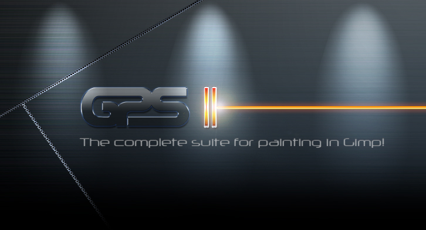

注意：虽然该项目本身功能非常强大，您可能可以毫无问题地使用它，但需要注意的是，我目前无法实现新功能或分析错误报告。
除此之外，享受 PhotoGIMP Painter Studio！:)

# 🎨 PhotoGIMP Painter Studio


为 Adob​​e Photoshop 用户优化 GIMP 2.10+ 的补丁，包括如下功能：

* 工具组织模仿Adobe Photoshop的位置；
* 默认安装新的 Python 过滤器，例如“修复选择”；
* 新的启动画面
* 新的默认设置可以最大化画布上的空间；
* 与 Windows 版 Photoshop 中的快捷方式类似，请参阅 Adob​​e 的文档；
* 来自自定义 .desktop 文件的新图标和名称。
* 现在默认使用系统语言，如果您愿意，您仍然可以在设置中进行更改。
* 画笔以图标形式显示。（适合不同语言的用户）
* 排列有序，分类清晰。
* 选择合适的画笔并更换画笔形状以获得新的效果。（避免总是创建新的画笔）
* 项目中包含的 SVG 文件（路径）可与画笔一起使用来创建效果线。




# 什么是 GIMP Paint Studio (GPS)？

GPS 是画笔和配套工具预设的集合。工具预设是一种简单保存的工具选项，是 GIMP 非常有用的功能。

GPS 的目标是为平面设计师和艺术家提供适当的工作环境，让他们从第一次使用 GIMP 开始绘画并感到舒适。稍后，用户将根据自己的工作流程偏好和对 GIMP 的理解更改这些设置。

您可以在 [WIki](https://code.google.com/archive/p/gps-gimp-paint-studio/) 中了解有关 GPS 的更多信息

谢谢您的使用！祝您绘画愉快！
[Ramón Miranda GPS 所有者](www.ramonmiranda.com)

# 项目名
项目名称 = `我的名字缩写` + `GIMP` + `Painter`

- `Painter` 这个词是为了更好地解释该项目的功能。GIMP 与 Painter 中的 `P` 相邻，因此将两个 `P` 合并在一起。

项目名称为**SLOS-GIMPainter**

# MyPaintBrushes-GIMP
MyPaint-Brushes for GIMP 2.10.x


**[我](https://github.com/SenlinOS)为 GIMP 制作了这些 MyPaint-Brushes**。

**该笔刷不适用于MyPaint**，例如“002 Frame Line”在MyPaint中会出现“漏笔”现象。
<br />在 GIMP 2.10 中，按住 Shift 键“002 Frame Line”可以绘制直线。

其他毛笔也调试过了，如“005书法”就是硬边的。
<br />“006画笔”以最大压力绘制，边缘不会出现锯齿状。

**MyPaint 不需要这些画笔**，它只是为 GIMP 2.10 设计的。
<br />而且[我](https://github.com/SenlinOS)在调试时不小心删除了MyPaint-brushes“.conf”文件……

# 风格：
排列有序，分类清晰。

## 📷 Screenshots


## ⚙ 如何安装（使用 Flatpak）

此软件包完全是关于 flatpak 的，但它还包含“仅文件”，您可以在任何版本的 GIMP（.deb、.rpm、Snap、AppImage、Windows、macOS）上使用它们。只需检查 GIMP 配置文件的位置即可。

**安装后，启动并退出 GIMP，然后再继续！**

### 准备 Flatpak 环境

*如果您之前通过 .deb、.rpm 等安装了 GIMP，请确保删除目录“$HOME/.config/GIMP”，因为这可能会导致与 Flatpak 配置文件冲突。*

1. 首先，你需要使[用 Flatpak](https://flatpak.org/setup/) 在系统上安装最新的 GIMP
2. 通过您的 AppCenter/Package Manager 或终端安装 GIMP Flatpak：
   ```flatpak install flathub org.gimp.GIMP```

### 安装 PhotoGIMP Painter Studio

在 [PhotoGIMP-Painter-Studio-master.zip](https://github.com/RepeatedKibbles/PhotoGIMP-Painter-Studio/archive/refs/heads/master.zip) 的 .zip 文件中，您将找到三个文件夹（在非 Windows 系统上隐藏，因为它们的名称以点开头）。所有这些文件夹都必须解压到您的 `$HOME` 文件夹中，如果您已经拥有旧安装中的相同文件，则将覆盖所有内容。

该文件包含以下目录：

* `.icons` （有一个新的 PhotoGIMP 图标）
* `.local` （其中包含个性化的 .desktop 文件）
* `.var` （包含针对 GIMP 2.10+ 的 flatpak 补丁定制）

如果您只想定制 PhotoGIMP 而不更改原始 GIMP 图标及其名称，只需将“ .var”文件夹提取到您的主目录即可。

- 编辑 -> 首选项 ->（文件夹 -> MyPaint 画笔）。
- 点击[添加新文件夹]按钮，打开[SLOS_MPB]目录。
- 重新启动 GIMP。

**菜单、设置安装：**

- 编辑 -> 首选项 ->（文件夹 -> 画笔），（文件夹 -> 动态），（文件夹 -> 工具预设）
- 点击【添加新文件夹】按钮，分别打开SLOS-GIMPainter文件夹中相应目录：

	示例位置： `□ /.../SLOS-GIMPainter/brushes`

	示例位置： `□ /.../SLOS-GIMPainter/dynamics`

	示例位置： `□ /.../SLOS-GIMPainter/tool-presets`

	**点击截图中位置1、2、3，打开对应目录，点击确定即可完成。**
	<br />(/home/.../ 是演示位置，以您存储SLOS-GIMPainter的位置为准）

	

	

	

- 重新启动 GIMP。

**注意：** 不要选中该框以防止更改 SLOS-GIMPainter 的默认设置。

- 我[没](https://github.com/SenlinOS)有通过将相应目录复制到 GIMP-Profile-Folders 来安装 SLOS-GIMPainter。因为无法取消复选框。（也许你会不小心修改了默认参数）
- [我的](https://github.com/SenlinOS)建议的方法是使用 GIMP 菜单的（编辑 -> 首选项 -> 文件夹...）手动打开项目文件夹中的相应目录。

## ⚙ 如何安装（其他）

因为它只是文件，所以您唯一需要做的就是将驻留在特定文件夹中的所有文件从该包 `/.var/app/org.gimp.GIMP/config/GIMP/2.10` 复制到 GIMP 的配置中每个特定系统上的文件夹，覆盖现有的文件夹。

**安装后启动并退出 GIMP，然后再继续！**

The new icon needs to be set manually.

### Ubuntu Snap

Configuration folder: `$HOME/snap/gimp/47/.config/GIMP/2.10/`

### Other Linux or Unix(-like) systems (.deb, .rpm, etc.)

Configuration folder: `$HOME/.config/GIMP/2.10/`

### macOS

Configuration folder: `"$HOME/Library/Application Support/GIMP/2.10/"`

* [Video Tutorial by Davies Media Design on macOS](https://youtu.be/5nXhtaGQs9U)

### Mac OS Easy Installer (made by: [@MatthijsKamstra](https://github.com/MatthijsKamstra))

> Gimp needs to be installed ([brew](https://formulae.brew.sh/cask/gimp) or [otherwise](https://www.gimp.org/downloads/))

##### Run bash how to

you can [down](https://raw.githubusercontent.com/MatthijsKamstra/Mac-setup/master/install/photogimp_osx.sh) and run the bash script:

```bash
cd /path/to/download/folder
sh photogimp_osx.sh
```

### Windows

* Download the file [PhotoGIMP-Painter-Studio-master.zip](https://github.com/RepeatedKibbles/PhotoGIMP-Painter-Studio/archive/refs/heads/master.zip)
* Access the path `.var\app\org.gimp.GIMP\config\GIMP\2.10` from the ZIP, copy the files to the path `%APPDATA%\GIMP\2.10`
* [Video Tutorial by Davies Media Design on Windows](https://youtu.be/57DNUsf4A-0)

# Show Dialog
Open the Window menu: Dockable Dialogs -> Tool Presets, and you can see SLOS-GIMPainter.

- Click the small triangle button on the upper right of the Tool Presets dialog, and click to `View as Grid`.
- Click the small triangle button on the upper right of the Tool Presets dialog to `Preview Size` and select the `Large`.
- Select the `SLOS` tab at the top of Tool Presets dialog to hide the built-in presets.

	**After setting, in the menu, Edit -> Preferences -> Interface(Window Management), save the settings as shown in the screenshot, and click OK to finish.**

	

## Credits

* This project would not be possible without the amazing GIMP team.
* The Photo in the new Splash is from [Isabella Mariana](https://www.pexels.com/pt-br/@isabella-mariana-1022505)
* A BIG thanks to all Diolinux’s supporters on [Twitch](https://twitch.tv/Diolinux) and [YouTube](https://youtube.com/Diolinux).
* [GIMP Paint Studio](https://code.google.com/archive/p/gps-gimp-paint-studio/) was originally developed by [Ramon Miranda](https://www.ramonmiranda.com/) and now [ported](https://www.deviantart.com/pkgam/art/GIMP-Paint-Studio-2-0-2-1-Port-to-GIMP-2-10-850663044) from GIMP 2.8 to 2.10+ by [PkGam](https://www.deviantart.com/pkgam)
* [GIMP 2.10 Tool Preset Fixes](https://www.deviantart.com/pkgam/art/GIMP-2-10-Tool-Preset-Fixes-749387099) developed by [PkGam](https://www.deviantart.com/pkgam)
* [SLOS-GIMPainter](https://github.com/SenlinOS/SLOS-GIMPainter) developed by [SenlinOS](https://github.com/SenlinOS)
* [MyPaintBrushes-GIMP](https://github.com/SenlinOS/MyPaintBrushes-GIMP) developed by [SenlinOS](https://github.com/SenlinOS)

# License
The Project is under an GPL-3.0, GPL-2.0, MIT, CC BY-SA 3.0, and CC0 License. See the LICENSE file for more information.

**- GNU General Public (GPL):**
* gps-gimp-paint-studio ([GPL-2.0](https://github.com/RepeatedKibbles/PhotoGIMP-Painter-Studio/tree/master?tab=License-1-ov-file#:~:text=of%20the%20License.%0A%0A%20%20%20%20%2D%2D%2D-,License_gpl%2D2.0,-%3A%0A%0A%20%20%20%20%20%20%20%20%20%20%20%20%20%20%20%20%20%20%20%20GNU%20GENERAL%20PUBLIC))
* PhotoGIMP ([GPL-3.0](https://github.com/RepeatedKibbles/PhotoGIMP-Painter-Studio/tree/master?tab=License-1-ov-file#:~:text=%2D%2D%2D-,PhotoGIMP,-%3A%0A%0A%20%20%20%20%20%20%20%20%20%20%20%20%20%20%20%20%20%20%20%20GNU%20GENERAL%20PUBLIC))

**- Massachusetts Institute of Technology (MIT):**
* [SLOS-GIMPainter](https://github.com/RepeatedKibbles/PhotoGIMP-Painter-Studio/tree/master?tab=License-1-ov-file#:~:text=lgpl.html%3E.%0A%0A%2D%2D%2D-,SLOS%2DGIMPainter,-%3A%0A%0AMIT%20License%0A%0ACopyright)

**- Creative Commons (CC):**
* MyPaintBrushes-GIMP ([CC0](https://github.com/RepeatedKibbles/PhotoGIMP-Painter-Studio/tree/master?tab=License-1-ov-file#:~:text=of%20this%20License.%0A%0A%2D%2D%2D-,MyPaintBrushes%2DGIMP,-%3A%0A%0AGIMP%202.10%20%E5%8F%91%E5%B8%83))
* gps-gimp-paint-studio ([CC BY-SA 3.0 (License for Contents )](https://github.com/RepeatedKibbles/PhotoGIMP-Painter-Studio/tree/master?tab=License-1-ov-file#:~:text=License%20for%20Contents%3A%0A%0ACC%20BY%2DSA%203.0))

---


**Text Description:**

- For Line Art, please check the text description: [Here](https://github.com/SenlinOS/databox/blob/master/For-Line-Art_SLOS-GIMPainter.md).
- Manually save temporary presets, the text+video: [Here](https://github.com/SenlinOS/databox/blob/master/manually-save-temporary-presets.md).

**Other Tips:**

- GNU/Linux(X11) software becomes tracing paper, video: [Here](https://youtu.be/ArHPMmIMsq8).

- How to make perspective lines in GIMP, video: [Here](https://youtu.be/gIp5I0fXdlM).

## Contributors (PhotoGIMP)
<a align="center" href="https://github.com/Diolinux/PhotoGIMP/graphs/contributors">
  
</a>

## Patch Notes
-  [Veja as Notas de Lançamento em Português](https://diolinux.com.br/2020/06/photogimp-2020.html)
